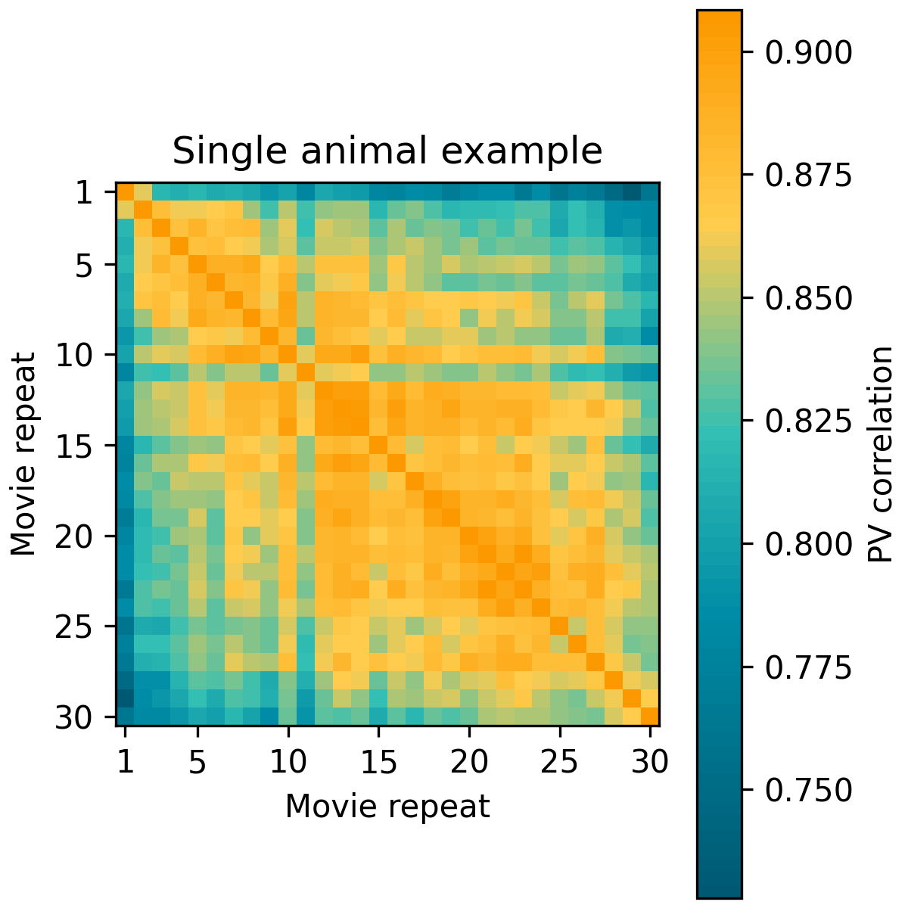
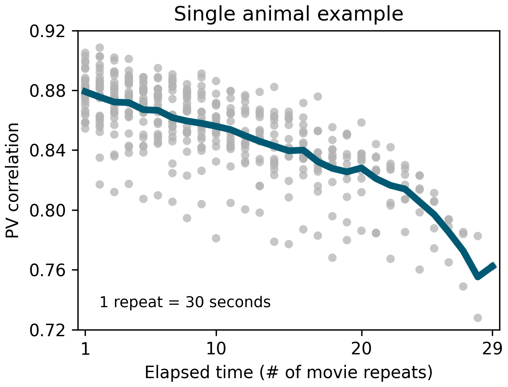
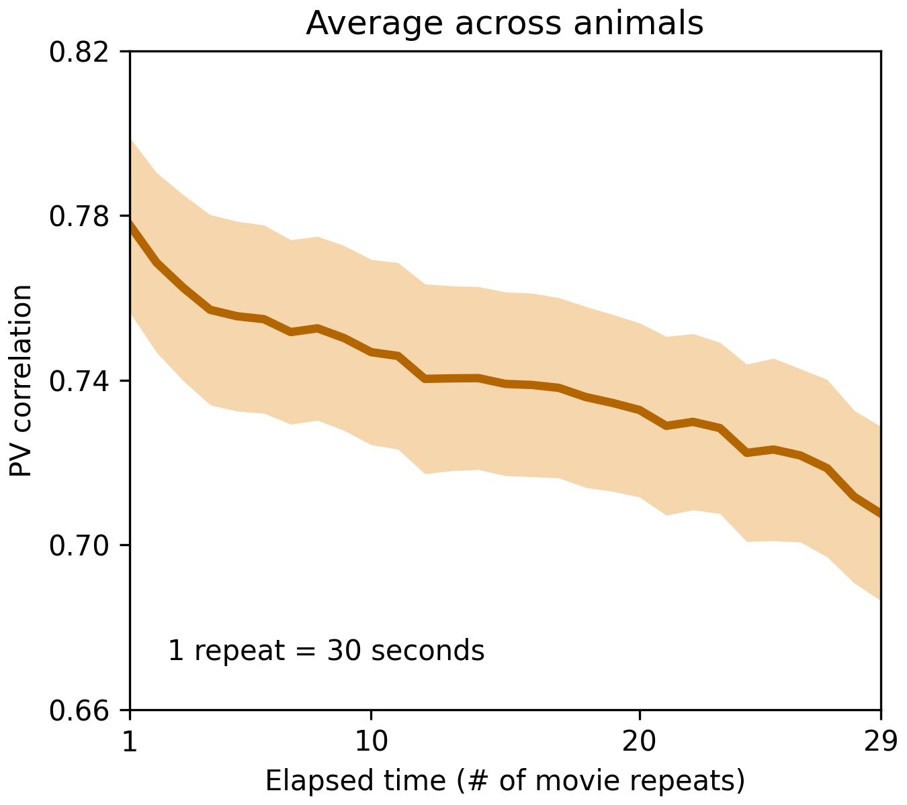
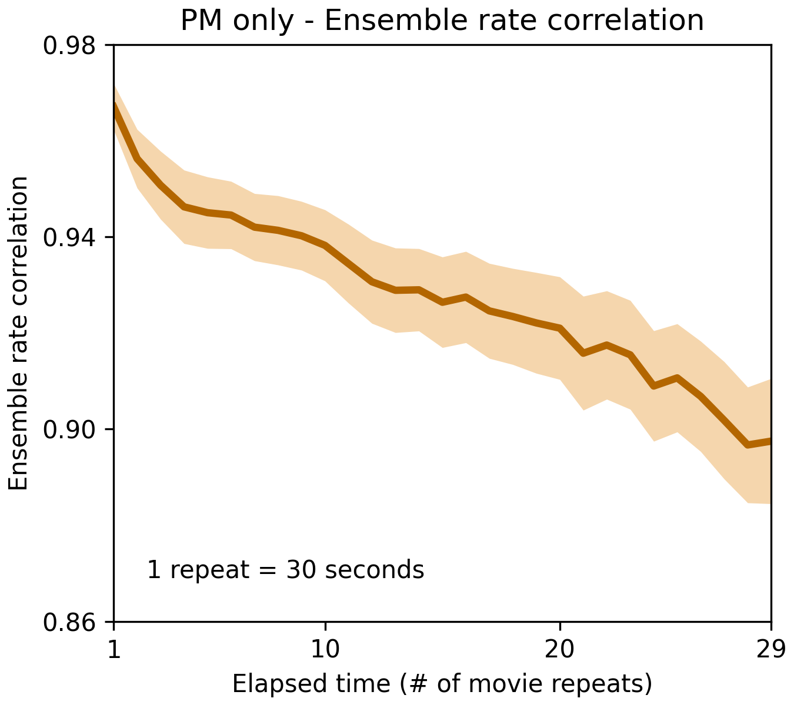

# Reproducing short-timescale representational drift in mouse visual cortex

## Abstract

This project reproduced a focused subset of Deitch, Rubin, and Ziv (2021), "Representational drift in the mouse visual cortex." I used the processed Neuropixels data from the official Ziv lab `visual_drift` repository and reimplemented selected Figure 2 analyses in Python. The scope was limited to Natural Movie 1 and area PM / VISpm. The final reproduced outputs were Figure 2B, Figure 2C, Figure 2E PM-only, and Figure 2H PM-only. The main result was that population-vector (PV) correlation decreased as the elapsed interval between repeated movie presentations increased, both in the representative mouse example and in the PM-only across-mice analysis. Ensemble rate correlation also decreased in the PM-only analysis, suggesting that changes in overall activity-rate patterns contribute to the observed drift. This is a focused reproduction of selected Figure 2 results, not a full reproduction of the entire paper.

## Introduction

Representational drift refers to gradual changes in neural activity patterns over time, even when the same stimulus is presented again. This is important because many models of sensory coding assume that the brain represents the same stimulus in a stable way. If the same natural movie produces changing population responses across repeated presentations, then neural representations are not fixed even over short timescales.

The original paper by Deitch, Rubin, and Ziv studied this question in mouse visual cortex. The paper asked whether neural responses to natural movie stimuli remain stable or drift over time. It used Neuropixels recordings and calcium imaging, and compared several kinds of similarity measures across repeated stimulus presentations.

This project focused on the short-timescale Neuropixels part of the analysis. I reproduced selected Figure 2 panels using Natural Movie 1. The main goal was not to reproduce every figure in the paper, but to build a small and auditable Python workflow that checks the central idea: responses to repeated natural movie presentations become less similar as the repeat interval increases.

## Data and scope

The data used here are processed Neuropixels files from the official Ziv lab `visual_drift` repository. I did not rebuild the data from raw AllenSDK NWB files. The main data variable used from the MATLAB files was `informative_rater_mat`, which contains processed activity matrices for natural movie stimuli and brain areas.

The stimulus was Natural Movie 1. Each repeat lasted 30 seconds. The brain area was PM / VISpm. For Figure 2B and Figure 2C, I used the representative mouse/session used in the original example: `session_831882777.mat`, corresponding to MATLAB mouse index 53, Natural Movie 1, PM / VISpm, and block A. This session had 72 PM units for the selected activity array.

For the across-mice analyses, I included Functional Connectivity sessions with 30 repeats per block and at least 15 PM units. This gave 16 valid mice for Figure 2E PM-only and 16 valid mice for Figure 2H PM-only. These are scoped PM-only reproductions. The original paper shows multiple visual areas, but this project intentionally limited the across-mice analysis to PM / VISpm to keep the workflow smaller and easier to inspect.

## Methods

### 5.1 Population vector construction

Natural Movie 1 was treated as a 30 second repeat sampled at 30 frames per second, giving 900 frames per repeat. Each repeat was divided into 30 one-second bins, with 30 frames in each bin. For every recorded unit and every time bin, activity was averaged across the 30 frames assigned to that bin. This created one population vector per time bin.

For the representative mouse, the extracted PM activity had shape `(72, 27000, 2)`: 72 units, 27,000 frames per block, and 2 blocks. Since 27,000 frames equals 30 repeats times 900 frames, each block contained 30 repeats. The binned population-vector tensor for both blocks together had units by 30 time bins by 60 repeats. For Figure 2B and Figure 2C, only block A repeats 1-30 were used.

### 5.2 PV correlation for Figure 2B, 2C, and 2E

For PV correlation, each movie repeat was kept as a matrix with shape units by 30 time bins. For a pair of repeats, Pearson correlation was computed between all time-bin population vectors. This gives a 30 by 30 time-bin correlation matrix. The main diagonal compares matching time bins in the two repeats. The mean of that diagonal is one PV correlation value for the repeat pair.

In Figure 2B, these scalar repeat-pair values were stored in a 30 by 30 matrix. Each row and column is a movie repeat. The matrix therefore summarizes how similar each repeat was to every other repeat in the same block.

In Figure 2C, the same Figure 2B matrix was collapsed by positive diagonal offsets. Lag 1 contains repeat pairs separated by one repeat, lag 2 contains pairs separated by two repeats, and so on until lag 29. Each gray point is one repeat pair, and the line is the mean value at each lag.

For Figure 2E PM-only, I applied the same PV correlation logic across all valid PM mice. Block A and block B were computed separately, then averaged per mouse. Finally, the mean and SEM were computed across valid mice for each elapsed-repeat lag.

### 5.3 Ensemble rate correlation for Figure 2H

Figure 2H used a different measure. Instead of preserving the 30 time bins for correlation, each repeat was collapsed into one activity-rate vector. For every unit, activity was averaged across all 30 time bins of the repeat. This produced one vector of mean activity rates per repeat.

Pearson correlation was then computed between repeat-level activity-rate vectors. The resulting matrix was directly a 30 by 30 repeat-pair ensemble rate correlation matrix. This matrix was collapsed by positive lag in the same way as Figure 2E. This measure tests whether the overall pattern of activity rates across units changes with elapsed repeats, without using the time-bin structure of the movie.

### 5.4 Validation and reproducibility

The project includes several checks. `main.py` performs a lightweight check that the final scripts and artifacts exist. The pytest suite validates that the final figures and tables exist, Figure 2C has 435 raw repeat-pair points, the lag structure is correct, valid mice match between Figure 2E and Figure 2H, and old legacy outputs are absent from the final output folders.

Each final analysis also saved a diagnostic report under `outputs/reports`. The representative mouse calculations include regression checks against the Figure 2C lag values for `session_831882777.mat`. These checks helped prevent accidental use of the wrong mouse, wrong block, or wrong correlation definition.

## Results

### 6.1 Figure 2B - Single-mouse PV correlation matrix

Figure 2B compares all 30 movie repeats with all other repeats for the representative PM mouse. The matrix is a repeat-by-repeat PV correlation matrix. Higher values close to the diagonal indicate that nearby repeats are more similar than repeats separated by a longer elapsed interval.

The diagonal of the plotted heatmap was adjusted only for visualization, following the original MATLAB figure logic. The saved scientific matrix keeps the original diagonal values. This single matrix shows the structure of the example session, but by itself it should not be interpreted as an across-mice result.

### 6.2 Figure 2C - Single-mouse PV correlation over elapsed repeats

Figure 2C collapses the Figure 2B matrix by elapsed repeat lag. Each gray point is one pair of movie repeats from the positive diagonals of the matrix. The line shows the mean PV correlation for each lag.

The exact lag means from the reproduced Figure 2C table were:

- lag 1: 0.8790726661765185
- lag 5: 0.8670373514020138
- lag 10: 0.8559255492816314
- lag 20: 0.8280860417055965
- lag 29: 0.7622767623745836
- lag 1 minus lag 29: 0.116795903801935

The curve decreases from lag 1 to lag 29. This reproduces the single-animal example pattern: repeats that are close together in time have more similar population responses than repeats that are farther apart.

### 6.3 Figure 2E PM-only - PV correlation across mice

Figure 2E PM-only extends the Figure 2C PV correlation logic across valid PM mice. The analysis included 16 valid mice. For each mouse, block A and block B were analyzed separately and then averaged. The final curve shows mean +/- SEM across mice.

The exact PM-only values were:

- lag 1: 0.7776326345431588 +/- 0.02124169903333209
- lag 5: 0.7555063676005271 +/- 0.023062537721002217
- lag 10: 0.7467836749041057 +/- 0.022496488820529986
- lag 20: 0.7327397050120855 +/- 0.02114492856990438
- lag 29: 0.7075688320105272 +/- 0.021177235138526037
- lag 1 minus lag 29: 0.0700638025326316

The diagnostic Friedman p-value was 2.0493202774895647e-37. This PM-only result supports short-timescale representational drift in area PM. It should be interpreted as a scoped across-mice reproduction, not as a reproduction of the full all-area Figure 2E panel from the paper.

### 6.4 Figure 2H PM-only - Ensemble rate correlation across mice

Figure 2H PM-only asks whether overall activity-rate patterns also become less similar over elapsed repeats. This analysis included the same 16 valid PM mice as Figure 2E. Each repeat was reduced to a vector of mean activity rate per unit, and repeat vectors were correlated.

The exact PM-only ensemble rate values were:

- lag 1: 0.9670183110848614 +/- 0.004803482544286741
- lag 5: 0.9449953343143915 +/- 0.007432598251201143
- lag 10: 0.9381958680411799 +/- 0.0073952766732096765
- lag 20: 0.9209784254864615 +/- 0.010669738614034332
- lag 29: 0.897484619910573 +/- 0.013022182793376741
- lag 1 minus lag 29: 0.0695336911742883

The diagnostic Friedman statistic was 293.03965517241386, with p-value 5.883820169426991e-46. The curve decreases over elapsed repeats, suggesting that activity-rate changes contribute to the PV drift. However, this does not fully separate rate changes from tuning changes, because Figure 2I tuning-curve correlation was not reproduced in this project.

## Comparison with the original paper

The Figure 2B and Figure 2C reproductions follow the same computational definition as the original MATLAB code for the representative PM mouse. The selected session, area, stimulus, block, and repeat structure were matched to the original example. The PV correlation was computed by correlating time-bin population vectors and averaging the matching-time-bin diagonal, rather than by averaging each repeat before correlation.

For Figure 2E and Figure 2H, this project reproduced the same analysis logic but only for area PM / VISpm. The original paper shows curves for multiple visual areas. This project focused on PM because it made the analysis feasible, easier to audit, and directly connected to the representative mouse example.

The qualitative trend is consistent with the paper: correlations decline as the elapsed repeat interval increases. This appears in the single-mouse PV analysis, the PM-only across-mice PV analysis, and the PM-only ensemble rate analysis.

Any numerical differences from the original full figure can come from the scoped PM-only analysis, the Python implementation, and the use of processed author data rather than rerunning the full MATLAB pipeline from raw AllenSDK data. For that reason, the results should be described as a focused reproduction of selected Figure 2 analyses, not as an exact full-paper reproduction.

## Limitations

The largest limitation is scope. Only PM / VISpm was included for the across-mice panels. Other visual areas from the original Figure 2E and Figure 2H were not reproduced.

Figure 2I tuning curve correlation was not reproduced. This means the project does not fully test whether drift is explained by rate changes, tuning changes, or both. The ensemble rate result suggests that rate patterns change, but it does not complete the full comparison from the paper.

Calcium imaging analyses were not reproduced. Long-timescale days/weeks analyses were also not reproduced. The project uses processed files from the authors' repository and does not reconstruct the dataset from raw AllenSDK NWB files.

Some final scripts are still relatively long, but they are isolated by figure and include validation outputs. This makes the workflow easier to audit than the earlier mixed inspection script.

## Conclusion

This project successfully reproduced a focused subset of Figure 2 from Deitch, Rubin, and Ziv (2021). The results support the main short-timescale claim that repeated presentations of the same natural movie show declining neural similarity over elapsed repeats. The PM-only ensemble rate analysis suggests that changes in activity-rate patterns are one contributor to the observed drift. The project provides a reproducible Python implementation with final figures, tables, diagnostics, tests, and a README describing the final workflow.

## References

- Deitch, D., Rubin, A., & Ziv, Y. (2021). Representational drift in the mouse visual cortex. Current Biology.
- Ziv lab `visual_drift` GitHub repository.
- Allen Brain Observatory / AllenSDK.
